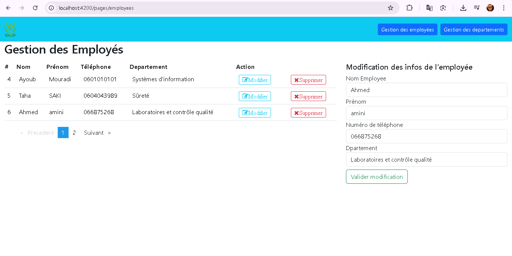
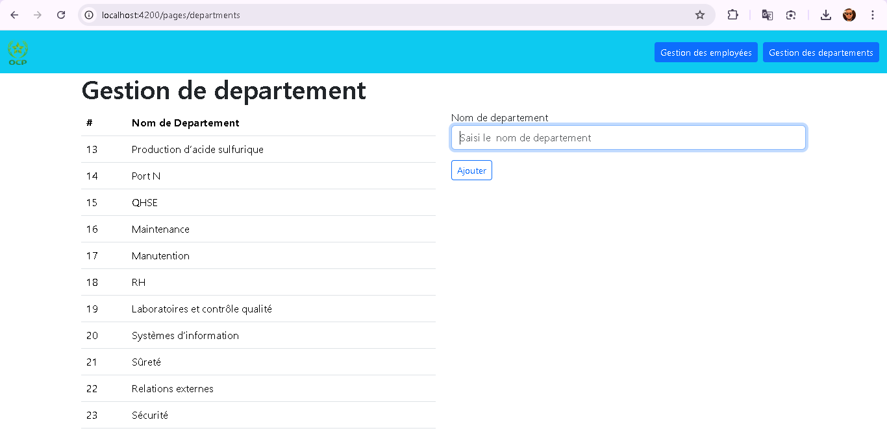

# Gestion des employés et départements

Auteur : Ayoub MOURADI

Résumé
------
Ce dépôt contient une application complète pour la gestion des employés et des départements. Le projet est composé d'un backend Java (Spring Boot) et d'un frontend développé en Angular. Ce fichier README fournit une vue d'ensemble du projet, les instructions pour lancer l'application, les technologies utilisées, ainsi que les emplacements des images et animations utilisées pour la documentation et l'interface.

Contenu clé
-----------
- Backend : dossier principal Java (Spring Boot) disponible dans le répertoire racine (`src/main/java/...`).
- Frontend : `OCP-Gestion-des-employes-et-Departement_FrontEnd` (Angular 12)
- Documentation visuelle / captures et animations :
  - `assest/1.png` → image pour la section Employés
  - `assest/2.png` → image pour la section Départements
  - `OCP-Gestion-des-employes-et-Departement_FrontEnd/PhReadme/` → captures supplémentaires (4 images : `1.png` à `4.png`)

Fonctionnalités principales
-------------------------
- Gestion CRUD des employés (ajout, modification, suppression, liste)
- Gestion CRUD des départements
- Pagination des listes (via `ngx-pagination` dans le frontend)
- Interface utilisateur responsive avec Bootstrap

Technologies utilisées
----------------------
- Backend : Java, Spring Boot
- Frontend : Angular 12, TypeScript, RxJS
- UI : Bootstrap 5, Font Awesome
- Outils / Tests : Angular CLI, Karma, Jasmine

Prérequis
---------
- Java JDK 11+ (pour le backend)
- Maven (pour construire le backend)
- Node.js (v12 ou v14 recommandé) et npm (pour le frontend)
- Angular CLI (optionnel)

Installation et exécution (rapide)
--------------------------------
1) Backend (Spring Boot)

	- Depuis la racine du projet où se trouve le `pom.xml` :

```powershell
mvnw.cmd spring-boot:run
# ou si Maven est installé globalement
mvn spring-boot:run
```

	L'API tourne par défaut sur `http://localhost:8080` (selon la configuration dans `application.properties`).

2) Frontend (Angular)

	- Ouvrez un terminal dans `OCP-Gestion-des-employes-et-Departement_FrontEnd` :

```powershell
cd OCP-Gestion-des-employes-et-Departement_FrontEnd
npm install
npm start
```

	- Le frontend s'exécute en dev sur `http://localhost:4200` par défaut.

Remarques :
- Si le backend écoute sur un port différent, mettez à jour l'URL de l'API dans le service Angular (`src/app/services/*`) ou dans `environment.ts`.

Assets (images et animations)
----------------------------
Les images que vous m'avez indiquées sont stockées sous `assest` à la racine du workspace :

- `assest/1.png` — image principale pour les employés
- `assest/2.png` — image principale pour les départements

Exemples d'inclusion dans ce README :




Images supplémentaires et animations
- Le dossier `OCP-Gestion-des-employes-et-Departement_FrontEnd/PhReadme` contient 4 captures/animations (`1.png` à `4.png`) que j'ai ajoutées pour la documentation du frontend. Vous pouvez les afficher depuis ce README (chemin relatif) si vous le souhaitez :


Conseils pour les animations
---------------------------
- Préférez les formats GIF ou MP4 pour les animations. Gardez une image PNG en fallback si nécessaire.
- Placez les animations destinées à l'application dans `OCP-Gestion-des-employes-et-Departement_FrontEnd/src/assets/animations/` et référencez-les depuis vos composants via `assets/animations/nom.gif`.

Modifications déjà effectuées
-----------------------------
- J'ai ajouté un README spécifique au frontend dans `OCP-Gestion-des-employes-et-Departement_FrontEnd/PhReadme/README.md` contenant les captures et recommandations.
- J'ai ajouté un fichier de licence nommé `LICENSE` (variante MTM basée sur MIT) à la racine du dépôt.

Licence
-------
Ce projet est distribué sous la licence **MTM** (fichier `LICENSE` à la racine). Le texte de la licence est basé sur la licence MIT mais renommé MTM selon votre demande. Voir `LICENSE` pour le texte complet.

Contact
-------
Pour toute question, modification ou exportation vers un autre format de documentation :

Ayoub MOURADI

---

Si vous souhaitez que j'ajoute d'autres animations (GIF/MP4) directement dans `assest` ou que j'intègre les images du frontend dans d'autres sections du README, dites-moi les fichiers à utiliser et je mets à jour ce fichier.

